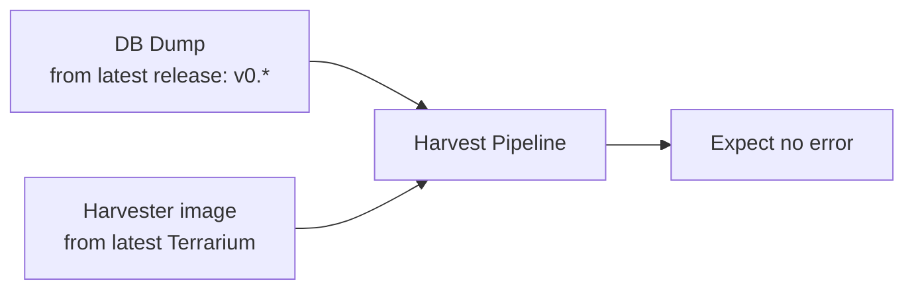
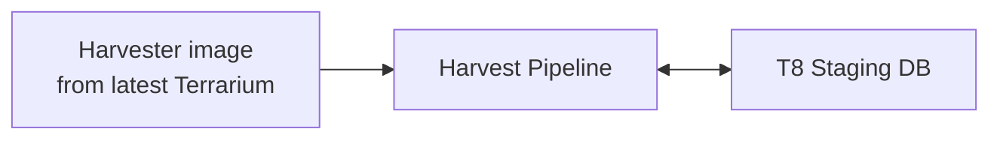
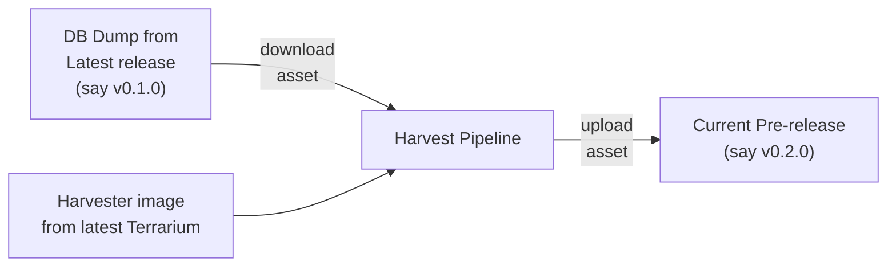

# Automaton flows on repository

The Farm repo has various automation flows in place. Mainly there are three events that trigger the automation in this repo:

1. New Pull request
2. Merge to the base branch (`main`)
3. Create new release tag (`v*`)

## 1. New pull request

The intent of automation pipelines here is to validate the changes coming from the pull requests.

This is a GitHub Action pipeline

## 2. Merge to the base branch (`main`)

There are two automation intents that run on merge to master:

### 1. Validation

This is same as the PR checks, but is important here to ensure sanity of the code merge.

This is a GitHub Action pipeline

### 2. Update the Staging API database

This is responsible to update the Staging DB so that Terrarium API on staging has latest data.

This pipeline connects to the T8 staging DB directly and runs harvest on it. Such that the harvest process appends new data to the DB while keeping the existing data as it is.

This is a Code Pipes pipeline

## 3. Create new release tag (`v*`)

The intent of the automation here is to upload release assets by harvesting the newly added artifacts and creating data dump of it.

NOTE: New release must not be created with "latest" label initially. Only after the assets are uploaded, the release should be marked as latest.

